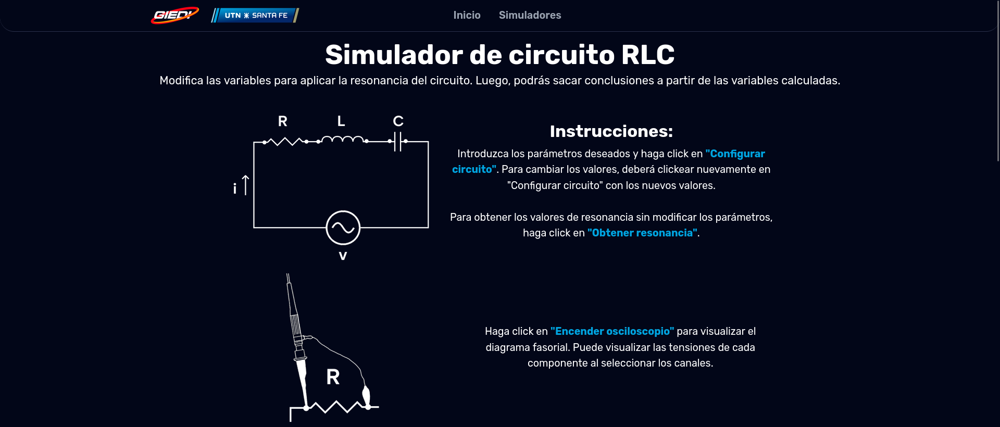
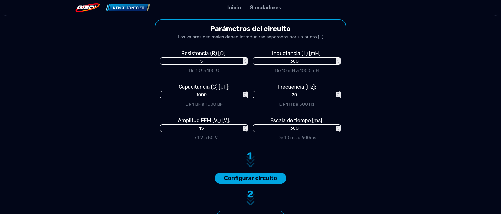
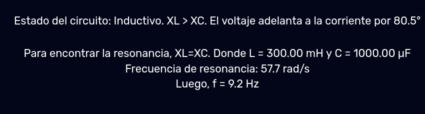
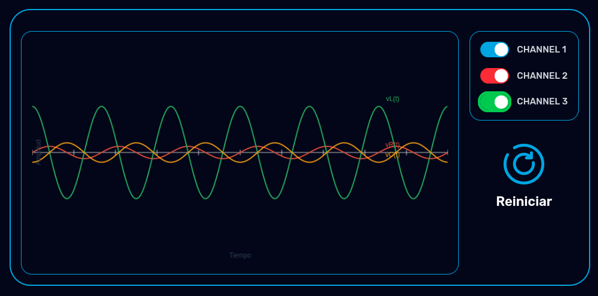
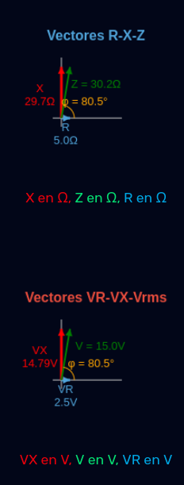
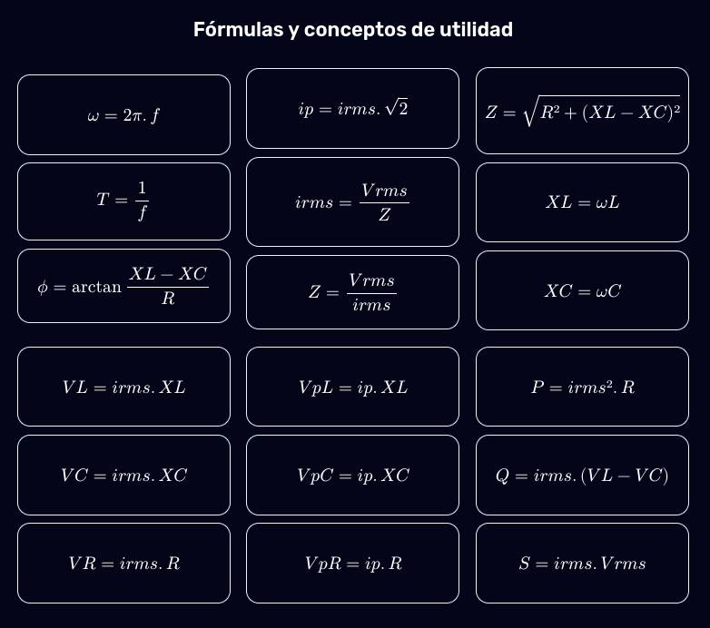
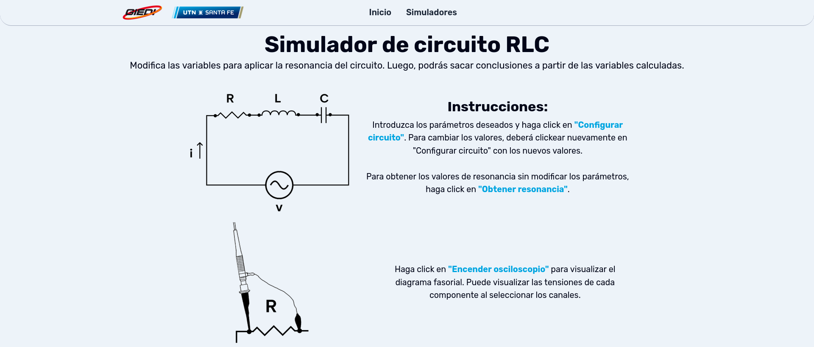
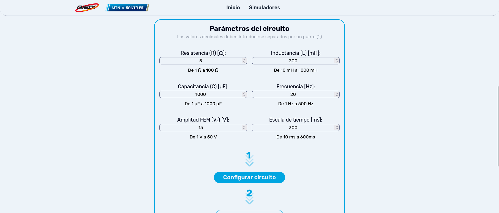

# Bitácora de Desarrollo - Simuladores físicos experimentales

**Autor:** Suárez B. Gael G.  
**Fecha:** `10/2025`  
**Versión:** `2.5.4`  
**Repositorio:** [giedi-utn en GitHub](https://github.com/GIEDI-UTN/giedi-utn.github.io)

---

## Objetivo

_Finalizar el simulador RLC._

---

## Actividades realizadas

### 1. Simulador RLC

Versión dark:

Cálculo de resonancia:

Osciloscopio:

Diagramas fasoriales:

Fórmulas implementando MathJax:

Versión light:

### 2. MathJax

MathJax es un motor de LaTeX para Javascript que permite incluir expresiones LaTeX en los navegadores. No genera imágenes, sino que utiliza fuentes nativas que permiten copiar la expresión para ser utilizada en otros programas (por ejemplo, Excel).

En cuanto a accesibilidad, genera texto alternativo que puede ser leído por lectores de pantalla, además de incluir una expresión interactiva para "guiar" al usuario a través de ella, pudiendo leerla por porciones en lugar de tener que escucharla de inicio a fin (útil para expresiones largas).

### 3. Casos de prueba:

Se tomaron en cuenta los valores pedidos en el trabajo práctico como test case. Se compararon con resultados calculados anteriormente.

---

## REFERENCIAS

- GUÍA DE TRABAJO PRÁCTICO: Circuito RLC en corriente alterna. Año 2025 – Rev.25.1. UDB Física – Dpto. Materias Básicas.
- Trabajo práctico final RLC 2024. UDB Física – Dpto. Materias Básicas.
- Trabajo práctico final RLC 2024 - Suarez Gael (resolución).
- [MathJax docs.](https://docs.mathjax.org/en/latest/index.html)

## Entrega parcial Octubre:

Simulador listo para implementarse en trabajos prácticos.

## Defectos conocidos

Problemas de resolución para tablets y tamaños intermedios entre PC y tablet. Solución: Sobreescribir los valores por defecto de lg y xl de Tailwind.

## Tecnologías utilizadas

| Herramienta      | Versión  | Uso en el proyecto      |
| ---------------- | -------- | ----------------------- |
| **HTML**         | `5`      | Estructura de la página |
| **Javascript**   | `ES13`   | Funcionamiento          |
| **Tailwind CSS** | `v4.1`   | CSS Framework           |
| **Chart.js**     | `v9.2.0` | Diseño de gráficas      |
