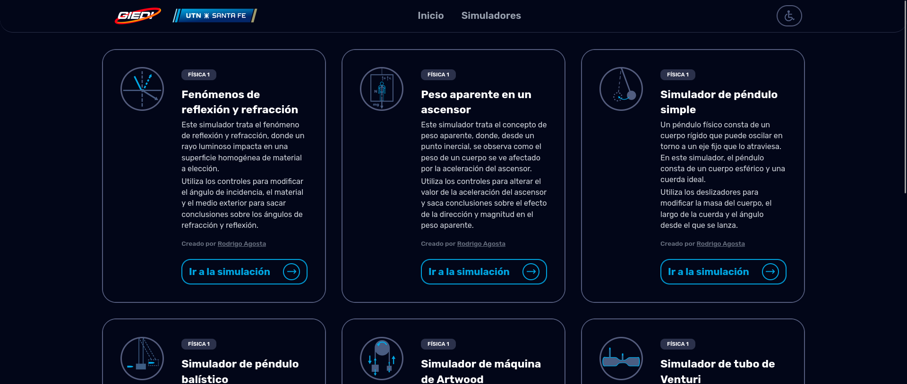
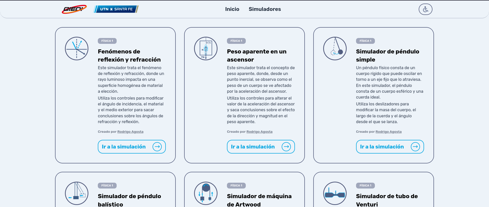
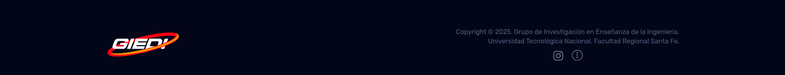
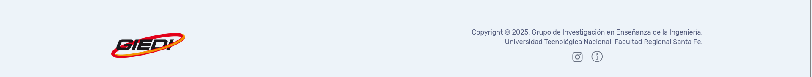

# Bitácora de Desarrollo - Simuladores físicos experimentales

**Autor:** Suárez B. Gael G.  
**Fecha:** `04/2025`  
**Versión:** `0.0.1`  
**Repositorio:** [giedi-utn en GitHub](https://github.com/GIEDI-UTN/giedi-utn.github.io)

---

## Objetivo

_Decidir qué tecnologías implementar. Maquetado de página principal._

---

## Actividades realizadas

### 1. Tarea principal: Decisiones de diseño e implementación

- **Detalles:**
  - Se evaluó usar React. Se descartó debido a curva de aprendizaje.
  - Se evaluó usar Bootstrap. Se descartó por decisión estética.
  - Se decidió usar Tailwind CSS debido a que es: Mobile-first, se adapta a temas del navegador (que toma, o no, tema del sistema) y es fácil que sea responsive. Permite ahorrarse un archivo .css que haya que actualizar constantemente.
  - Se generaron tres paletas distintas para el diseño. La primera consta de los colores naranjas propios del logo GIEDI y del color predefinido por Tailwind slate-950. La segunda consta del color institucional del logo UTN FRSF y slate-950. La tercera paleta utiliza los colores de la segunda paleta, con el agregado de una variante pastel del color institucional UTN para el modo claro y un color grisáceo oscuro para bordes.
  - Se decidió utilizar la tercer paleta luego de aprobado el mock-up inicial, donde se definieron los siguientes colores: _color-utn-regular_: oklch(0.68 0.141385 233.5329), _color-utn-light_: oklch(0.96 0.0103 247.93), _color-utn-dark_: oklch(0.48 0.0541 273.69).
  - Se decidió utilizar la fuente ["Rubik"](https://fonts.google.com/specimen/Rubik) perteneciente a Google Fonts.

### 2. Accesibilidad

La idea del sector de accesibilidad es implementar un toggle a la derecha de la página para que el usuario seleccione (o no) las configuraciones de accesibilidad que necesite. A su vez, que no sea exclusiva de la sesión, sino que el navegador logre recordarlas.

- **Baja visibilidad**
  - Se propuso un modo alto contraste en el que el fondo de la página pasa a ser negro (#000000) y el texto blanco (#FFFFFF). El texto aumenta de tamaño y se prioriza colocar negrita en secciones de importancia, al igual que el uso de la etiqueta \<strong>. Como buena práctica, toda etiqueta tiene un atributo alt describiendo el elemento, sobretodo si es un ícono o imagen.
- **Dislexia**
  - Se propuso el uso de una fuente open-source llamada ["opendyslexic"](https://opendyslexic.org/about) creada para ayudar a las personas con dislexia a mejorar su experiencia de lectura. La fuente es ligeramente más ancha en la parte inferior e indican la dirección en que deberían leerse para prevenir los síntomas a la hora de leer de izquierda a derecha. Más información [acá](https://opendyslexic.org/related-research).

### 3. Maquetado

- **Navbar**

  - El primer prototipo contaba con los botones de Inicio y Simuladores del lado izquierdo, con el logo de GIEDI en el centro y el botón de accesibilidad en la derecha.
  - Finalmente, se optó por colocar el logo de GIEDI a la izquierda, junto con el logo institucional de la UTN FRSF. En el centro, los botones Inicio y Simuladores, y a la derecha el botón de accesibilidad.

- **Body**
  - El cuerpo contenía una sección hero introductoria, junto a dos botones. Uno llevaba a los simuladores, otro llevaba a la wiki.
  - Se decidió directamente mostrar los simuladores en forma de grid, donde cada tarjeta contiene: Autor, materia a la que pertenece, una ilustración que la caracteriza, título y descripción.

- **Footer**
  - Para el footer se sigue la misma línea visual de la navbar: Logos a la izquierda, información a la derecha. La información consta de una descripción pequeña del GIEDI, el año en que fue creada la página y dos íconos que redirigen a redes sociales e información sobre el proyecto.

---

Entrega parcial Abril: Home + Simulador de reflexión y refracción

## Tecnologías utilizadas

| Herramienta      | Versión  | Uso en el proyecto                       |
| ---------------- | -------- | ---------------------------------------- |
| **HTML**         | `5`      | Estructura de la página                  |
| **Javascript**   | `ES13`   | Funcionamiento                           |
| **Tailwind CSS** | `v4.1`   | CSS Framework                            |
| **Flowbite.js**  | `v9.2.0` | Componentes predefinidos de Tailwind CSS |
