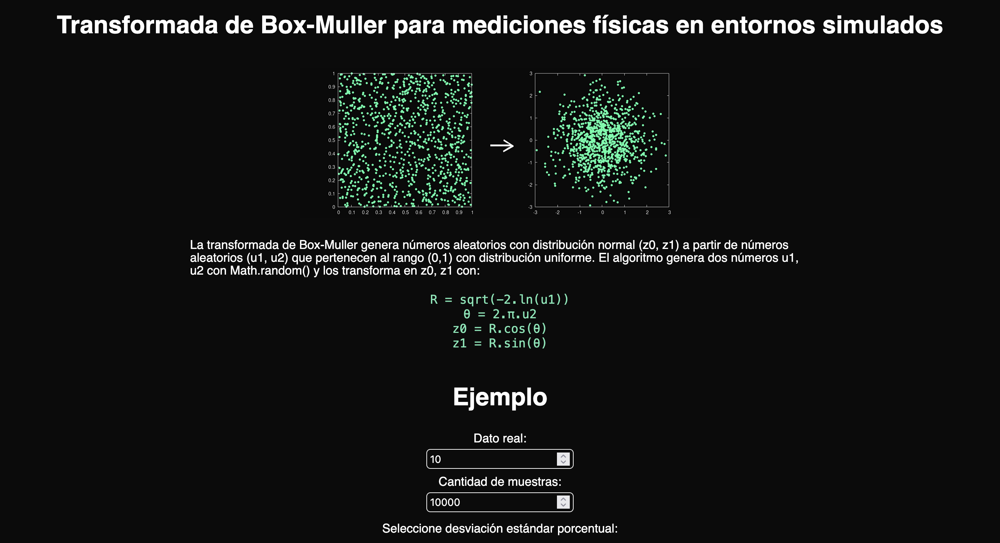
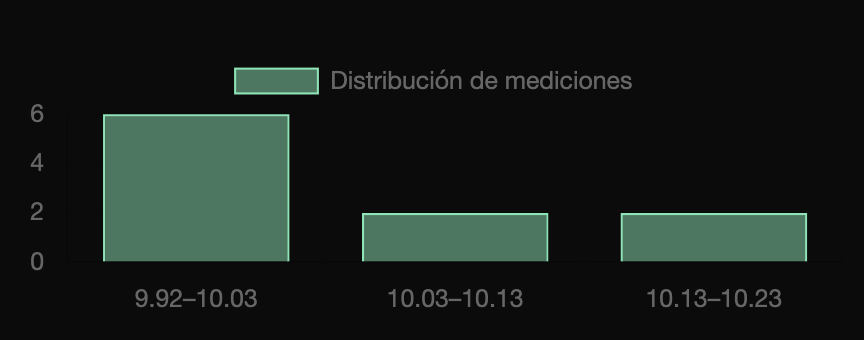
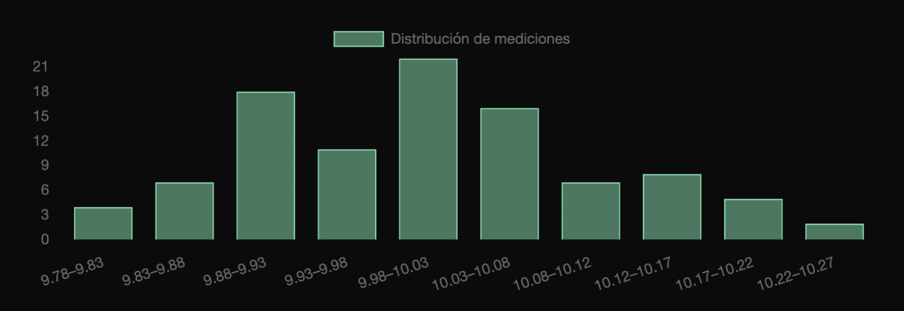
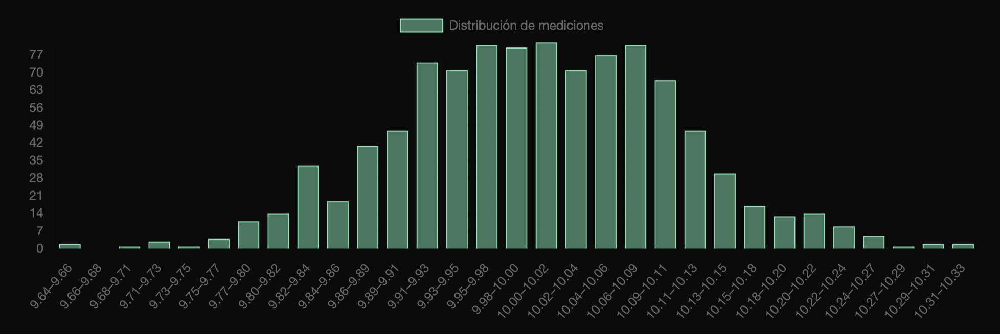
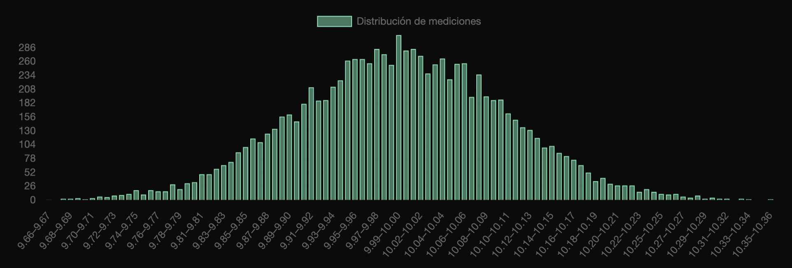
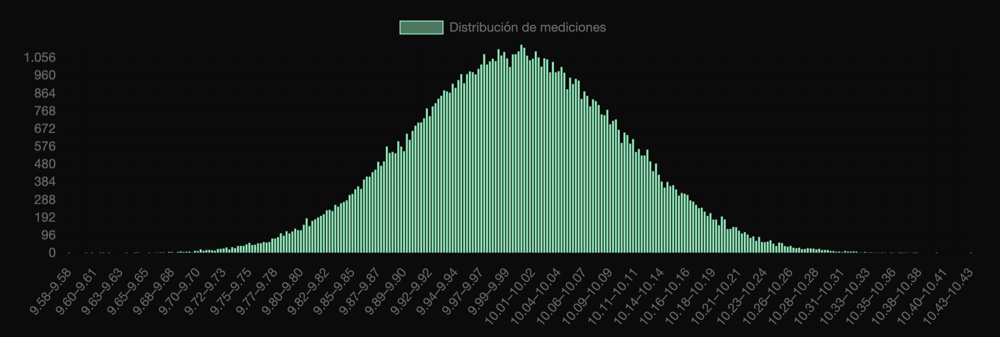
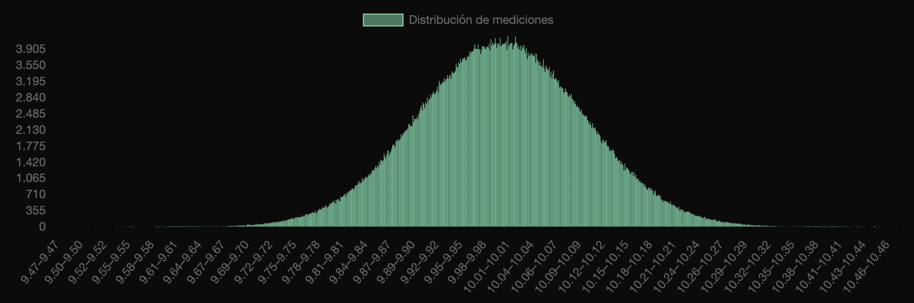

# Bitácora de Desarrollo - Simuladores físicos experimentales

**Autor:** Suárez B. Gael G.  
**Fecha:** `05/2025`  
**Versión:** `0.9.0`  
**Repositorio:** [giedi-utn en GitHub](https://github.com/GIEDI-UTN/giedi-utn.github.io)

---

## Objetivo

_Implementar la generación de errores con distribución normal._

---

## Actividades realizadas

### 1. Tarea principal: Método del generador de errores

**Detalles:**
Al inicio, se contempló generar los errores con pequeños porcentajes de desviación para cada una de las fuentes: Medición, condiciones iniciales y apreciación. Por ejemplo, para la medida del tiempo en el péndulo, el error podía ser del 1% y provenía de la propia medición del alumno (como si usara un cronómetro), y además, el cronómetro tenía su error propio de apreciación del instrumento del 0,1%.

Sin embargo, esto implicaba una personalización del porcentaje para cada simulador. Si bien permite que sea teóricamente más apegado a la teoría de errores (las fuentes son transparentes) también requiere más codificación.

---

**Algoritmo de Box-Muller**

El algoritmo de [Box-Muller](https://es.wikipedia.org/wiki/M%C3%A9todo_de_Box-Muller) es una transformación matemática que permite transformar dos números aleatorios de distribución uniforme (como los generados por math.random) y los transforma en dos números aleatorios de distribución normal.


Anillos distribuidos uniformemente con respecto al origen (u1, u2). Ingresan a la transformación. El producto son los mismos anillos que se distancian cada vez más entre sí conforme se van alejando del origen.

Una vez implementado, la función genError recibe dos parámetros, donde el primero es el valor exacto y el segundo, el error porcentual. Como el algoritmo devuelve dos números y solo se necesita uno en el llamado, se almacena en una variable externa a la función para poder devolverla en el segundo llamado y ahorrar tiempo de ejecución.

Basta con llamar a la función, entregarle el valor original y obtener de salida el valor con el error aplicado.

---

**Codificación del algoritmo en Javascript**

u1 y u2 son dos valores reales con distribución uniforme. Como los produce la función random, son números pseudo aleatorios de distribución uniforme entre (0,1].

$R = sqrt(-2.ln(u1))$
$θ = 2.π.u2$

Valores con distribución normal z1 y z2:

$z0 = R.cos(θ)$
$z1 = R.sin(θ)$

```
function genError(real, destd) {
destd = real * (destd / 100);

if (sobra) {
  sobra = false;
  return resto * destd + real;
}

let u1 = Math.random();
const u2 = Math.random();

if (u1 === 0) {
  u1 = Number.MIN_VALUE;
}

const R = Math.sqrt(-2.0 * Math.log(u1));
const theta = 2.0 * Math.PI * u2;

const z0 = R * Math.cos(theta);
const z1 = R * Math.sin(theta);

sobra = true;
resto = z1;

return z0 * destd + real;
}
```

## REFERENCIAS

[The Box Muller method for simulating normal variables](https://hpaulkeeler.com/the-box-muller-method-for-simulating-normal-variables/)
[How to generate Gaussian sample](https://medium.com/mti-technology/how-to-generate-gaussian-samples-3951f2203ab0)
[Box-Muller transformation](https://mathworld.wolfram.com/Box-MullerTransformation.html)
[La transformación de Box Muller](https://intsight.com/index.php/2020/03/17/la-transformacion-de-box-muller/)
[Box-Muller transform (Wikipedia)](https://en.wikipedia.org/wiki/Box%E2%80%93Muller_transform)
[Simulación de variables aleatorias
Con distribución normal](https://repositorio.uptc.edu.co/server/api/core/bitstreams/f7e1c134-2db9-41cf-92bc-91036cd72ae7/content)

---

## Entrega parcial Mayo:

Página con la teoría recolectada sobre la transformación y un pequeño programa para mostrar la entrada/salida de la función. Este recibe un valor exacto, el porcentaje de error, y devuelve un gráfico de barras con la cantidad de muestras elegidas sin espacios ni formato en caso de que quieran copiarse los datos directamente a un excel.

La estética de esta página no sigue la estética de la página del GIEDI porque es únicamente de ayuda conceptual.



Se puede ver la diferencia entre la cantidad de muestras y como las barras deforman la curva gaussiana que intentan imitar.

Casos de prueba: 10, 100, 1.000, 10.000, 100.000 y 1.000.000 muestras. 1% de error porcentual. Dato real: 10.








## Tecnologías utilizadas

| Herramienta    | Versión  | Uso en el proyecto         |
| -------------- | -------- | -------------------------- |
| **HTML**       | `5`      | Estructura de la página    |
| **Javascript** | `ES13`   | Funcionamiento             |
| **CSS**        | `v5.0.1` | Hojas de estilo en cascada |
| **Chart.js**   | `v9.2.0` | Diseño de gráficas         |
