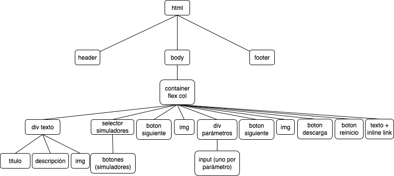
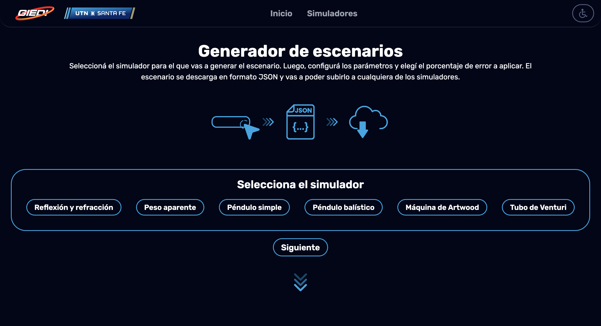
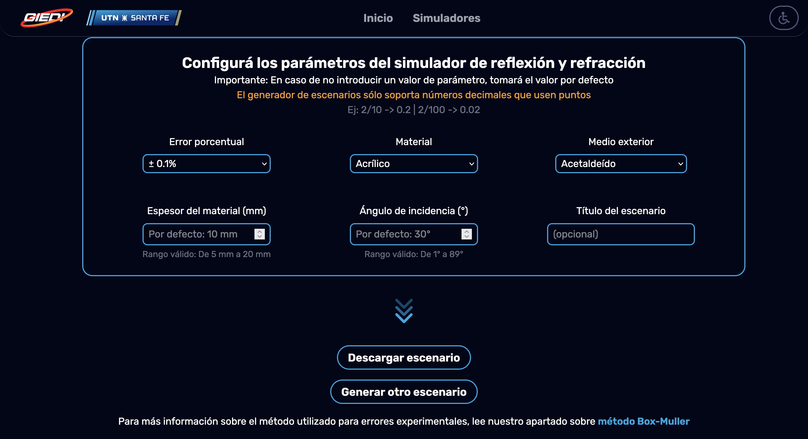
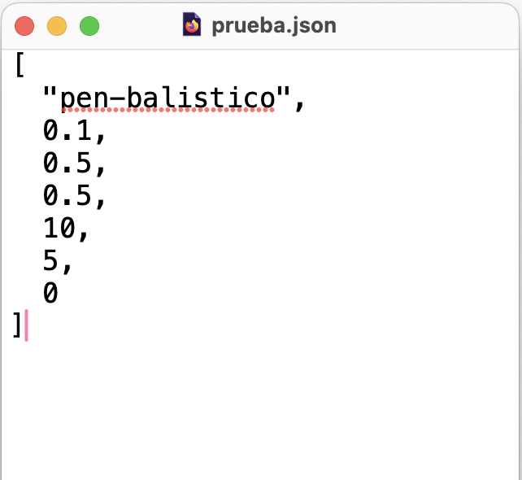

# Bitácora de Desarrollo - Simuladores físicos experimentales

**Autor:** Suárez B. Gael G.
**Fecha:** 06/2025, 07/2025
**Versión:** `0.9.3 (inicial)` `1.0.0 (final)`
**Repositorio:** [giedi-utn en GitHub](https://github.com/GIEDI-UTN/giedi-utn.github.io)

---

## Objetivo

_Desarrollar la herramienta de creación de escenarios. Incorporar la generación de errores de acuerdo a la selección de error porcentual. Carga y descarga con éxito del documento JSON._

---

## Actividades realizadas

### 1. Tarea principal: Herramienta de generador de escenarios

**Detalles:**
Para tener mayor control de la interactividad, el contenido se va mostrando conforme se presionan los botones para _continuar_. Por ejemplo, si se presiona el boton _continuar_ pero no hay simulador seleccionado, la ejecución se interrumpe.

jQuery es el encargado de mostrar y ocultar cada caja de información como respuesta ante hacer click a un botón de _continuar_.

**Maquetado**
La estructura de la página toma la siguiente forma:



**Caja con parámetros**
Los parámetros corresponden a cada uno de los parámetros editables de los simuladores, además de el error porcentual (con selector único de tipo radio) y el título del documento a descargar que es opcional. Por defecto, el nombre es "escenario.json".

| Tipo de dato                            | Tipo de input | Simulador                  | Restricciones                                                                                                                                       |
| --------------------------------------- | ------------- | -------------------------- | --------------------------------------------------------------------------------------------------------------------------------------------------- |
| Número                                  | Manual        | Todos                      | Sólo números. Mínimo, máximo y paso según rangos acordados.                                                                                         |
| Material, medio exterior, tipo de polea | Desplegable   | Óptica, Máquina de Artwood | Opciones limitadas. Es fácil modificar opciones en el futuro.                                                                                       |
| Diámetro de entrada                     | Desplegable   | Tubo de Venturi            | Opciones limitadas y reglamentadas por estándar. Fácil de modificar si en el futuro el estándar se actualiza. No ocupa tanto espacio como un radio. |
| Error porcentual                        | Radio         | Todos                      | Elección única y limitada. Obvia visualmente, acotada.                                                                                              |
| Título                                  | Manual        | Todos                      | String, sin restricciones.                                                                                                                          |

El botón descargar escenario revisa cada uno de los valores ingresados. Tiene valores por defecto que se informan al usuario en caso de que no ingrese ningún valor; de lo contrario, el valor debe estar dentro del rango definido en gris claro bajo la caja. Si todos los valores están correctos, se descarga el escenario en formato JSON. De lo contrario, un cartel de alerta informa cada uno de los valores incorrectos.

El link asociado a "método Box-Muller" lleva a la página descrita en el devlog de [mayo](../5-mayo/mayo.md).

**Descarga del escenario JSON**
El primer valor de cada archivo es un string que indica el simulador para el que fue creado ese escenario. Esto permite que en la carga se haga un control de compatibilidad: Si el valor del string coincide con el nombre del simulador en uso, se lee el archivo; de lo contrario, se informa por pantalla al usuario.

El resto de los valores se cargan en el mismo orden en que se presentan en la herramienta de escenarios. No cuenta con un sistema clave valor, sino que sólo se almacena el valor para aislar esta información del estudiante y que no interfiera con su proceso de conclusión/experimentación.

**Codificación:**

```
function exportarJSON (data, titulo) {
    const blob = new Blob([JSON.stringify(data, null, 2)], {
    type: "application/json",
    });
    const url = URL.createObjectURL(blob);

    const a = document.createElement("a");
    a.href = url;
    a.download = titulo + ".json";
    a.click();

    URL.revokeObjectURL(url);
}
```

La función recibe los valores cargados y el título (que en caso de no haberlo introducido, es por defecto "escenario").

Se genera un nuevo Blob en una constante (en este caso, también llamada blob) y se le indica que emitirá archivos de tipo JSON a través de type. Blob recibe el array data mediante JSON stringify y reemplaza valores vacíos con null (replacer). Deja, además, dos espacios de identación.

Luego, se genera un objeto URL al que se le pasa la constante blob. El método createObjectURL requiere de un objeto tipo File o Blob y genera una URL temporal que apunta al blob en la memoria del navegador.

Se genera un elemento de tipo a (link) al que se le pasa el objeto URL creado con anterioridad como atributo href, lo que permite que el archivo JSON se pueda descargar. Se descargara con el nombre elegido en titulo y extensión ".json".

Sólo es válida por sesión y para este documento en particular.

Finalmente, se libera el objeto usando revokeObjectURL.

## Carga del escenario en un simulador

Se comenzó agregando una variable booleana que indica si hay un escenario cargado o no. Esto permite que incluso visitantes de la página que no son alumnos con escenario designado puedan generar datos con errores gaussianos. Si hay un escenario cargado, hayEscenario es true y el error porcentual se toma del archivo JSON; de lo contrario, el error porcentual es de $\pm0,1$.

Cuando se carga el archivo, se llama a la función importarJSON.

```
function importarJSON(event) {
const file = event.target.files[0];
if (!file) return;

    const reader = new FileReader();
    reader.onload = function(e) {
      try {
        const data = JSON.parse(e.target.result);
        if (data[0]!="reflexion"){
          alert("El escenario subido no corresponde a este simulador.")
        }
        else{
          setearEscenario(data);
        }

      } catch (err) {
        alert("Error al leer el archivo JSON");
      }
    };

    reader.readAsText(file);
}
```

La variable reader almacena una nueva instancia de fileReader que le va a permitir leer el escenario. onload se dispara si el archivo fue cargado con éxito. Para eso, se usa try-catch: Si se cargó correctamente, se parsea el archivo en un array llamado data, de lo contrario se informa por pantalla y se detiene la ejecución.

Al cargarse con éxito, se evalúa que la cabeza del archivo coincida con el simulador, de lo contrario, se informa por pantalla que el escenario pertenece a otro simulador. Se llama a la función setearEscenario que recorre el array y asigna los valores a cada atributo de la simulación. Por ejemplo, en el simulador de reflexión-refracción:

```
simulation.error = parseFloat(data[1]);
simulation.material = data[2];
simulation.exteriorMedium = data[3];
simulation.thickness = parseFloat(data[4]);
simulation.realIncidenceAngle = parseInt(data[5]);
```

A continuación, se llama a la función inhabinput para evitar que se puedan modificar los valores cargados por escenario y que, además, informa que se cargó con éxito el escenario.

Finalmente, se llama a la función boxmuller que recibe de parámetro el índice de refracción experimental exacto calculado y el error porcentual como se describió anteriormente.

## Referencias

[Download JSON from browser - Colin Stubbs](github.com/colin-stubbs/js-download-json-from-browser/blob/master/example.html)
[JSON stringify - MDN dev](https://developer.mozilla.org/es/docs/Web/JavaScript/Reference/Global_Objects/JSON/stringify)
[Blob - MDN dev](https://developer.mozilla.org/es/docs/Web/API/Blob)
[createObjectURL - MDN dev](https://developer.mozilla.org/es/docs/Web/API/URL/createObjectURL_static)
[revokeObjectURL - MDN dev](https://developer.mozilla.org/en-US/docs/Web/API/URL/revokeObjectURL_static)
[fileReader - MDN dev](https://developer.mozilla.org/en-US/docs/Web/API/FileReader)

**Entrega parcial Junio:**
Herramienta de creación de escenarios finalizada, con archivos generados JSON que se incorporan con éxito a los simuladores.




Cada archivo JSON tiene la siguiente estructura, donde las claves no son visibles para el usuario receptor, solo los valores asociados.



Luego de corregir el simulador de péndulo simple, queda como tarea revisar una línea donde se llama al método a.click. Esto simula un click virtual, pero el usuario ya hace un click manual al apretar "Descargar escenario"

## Tecnologías utilizadas

| Herramienta  | Versión  | Uso en el proyecto                                                                                              |
| ------------ | -------- | --------------------------------------------------------------------------------------------------------------- |
| HTML         | `V5`     | Estructura de la página                                                                                         |
| Javascript   | `ES13`   | Funcionamiento                                                                                                  |
| Tailwind CSS | `v4.1`   | CSS Framework                                                                                                   |
| jQuery       | `v3.7.1` | Mostrar/ocultar paneles. Cambiar contenido interno del HTML para que los parámetros cambien según el simulador. |
