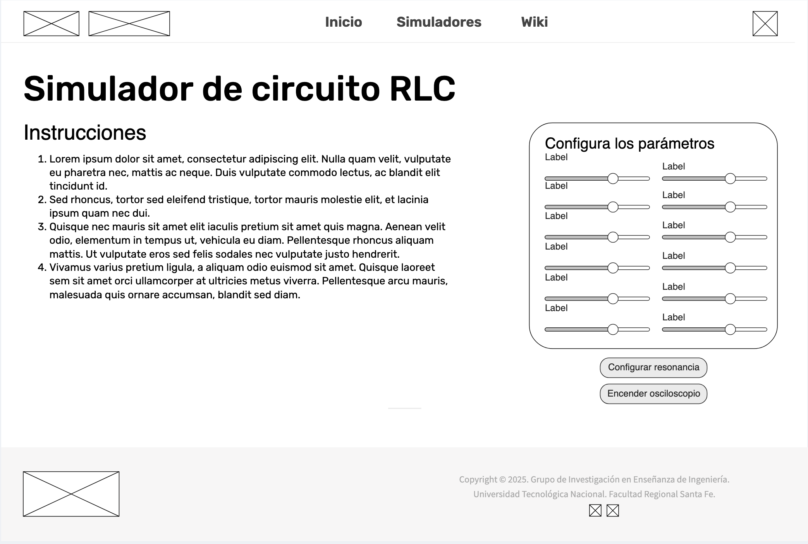

# Bitácora de Desarrollo - Simuladores físicos experimentales

**Autor:** Suárez B. Gael G.  
**Fecha:** `08/2025`  
**Versión:** `1.0.0`  
**Repositorio:** [giedi-utn en GitHub](https://github.com/GIEDI-UTN/giedi-utn.github.io)

---

## Objetivo

_Implementar el simulador de RLC sin errores._

---

## Actividades realizadas

### 1. Maquetado

## REFERENCIAS

---

## Entrega parcial Agosto:

Por completar

## Tecnologías utilizadas

| Herramienta    | Versión  | Uso en el proyecto      |
| -------------- | -------- | ----------------------- |
| **HTML**       | `5`      | Estructura de la página |
| **Javascript** | `ES13`   | Funcionamiento          |
| Tailwind CSS   | `v4.1`   | CSS Framework           |
| **Chart.js**   | `v9.2.0` | Diseño de gráficas      |
